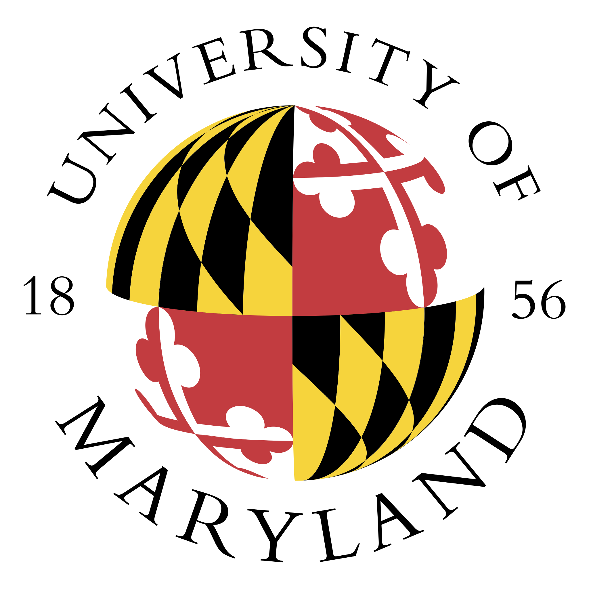
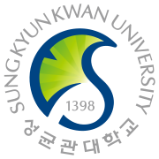
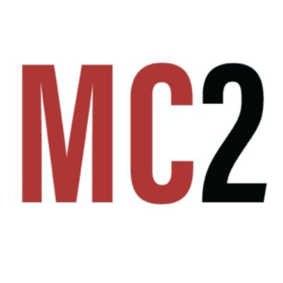

I'm a first-year Ph.D. student at University of Maryland, College Park, advised by [Tudor Dumitras](https://users.umiacs.umd.edu/~tdumitra/). During Ph.D. years, I aim to discern the gap of machine learning (ML) driven security applications (e.g., malware detection) between academia and real-world scenarios, and to bridge the gap by building ML model towards reliable and practical way, deployable in more realistic conditions. I also have interest in uncovering the security risk of ML models. 

Before joining UMD, I have researched on building data-driven user authentication and other defense solutions against security threats of Samsung devices and services at Samsung Research for 5 years. I received a B.S. degree in Software Engineering from Sungkyunkwan University and worked at Security Lab advised by [Hyoungshick Kim](https://seclab.skku.edu/people/hyoungshick-kim/).

My details are in [CV](../files/newCV_SungsuKwag.pdf)

News
======

------

Education 
======

------

>  <b>University of Maryland, College Park</b>    Ph.D. in Electrical and Computer Engineering 
> <h4 align="right"> Aug, 2023 - Present </h4>
>
>  <b>Sungkyunkwan University (SKKU)</b>    B.S. in Software Engineering 
> <h4 align="right"> Mar, 2012 - Feb, 2018 </h4>

Experience
======

------

>  <b>University of Maryland, College Park</b>    Graduate Assistant, <a href="https://cyber.umd.edu/">Maryland Cybersecurity Center</a>    (Advisor: Tudor Dumitras)
>  
 
Working on...
 - To Be Updated... 
 
> <h4 align="right"> College Park, Maryland, United States / Aug, 2023 - Present </h4>
>
>  <b>Samsung Electronics</b>    Software Engineer, Security & Privacy Team, <a href="https://research.samsung.com/">Samsung Research</a> 
>  
 
Worked on...
 - Research on Continous Multi-Factor Authentication (CMFA) of mobile device   - Research on Voice Assistant security against voice spoofing attack 
 
> <h4 align="right"> Seoul, South Korea / Mar, 2018 - Jul, 2023 </h4>
>
>  <b>Sungkyunkwan University (SKKU)</b>     Undergraduate Research Assistant, <a href="https://seclab.skku.edu/">Security Lab (seclab) </a>    (Advisor: Hyoungshick Kim)  
>  
 
Worked on...
 - Research on practical smudge attack of "Android Pattern Lock" system 
 
> <h4 align="right"> Seoul (Suwon), South Korea / Mar, 2014 - Sep, 2015 </h4>
>
>  <b>Samsung Electronics</b>    Intern, Security Lab, Software R&D Center 
> <h4 align="right"> Suwon, South Korea / Jul, 2014 - Aug, 2014 </h4>